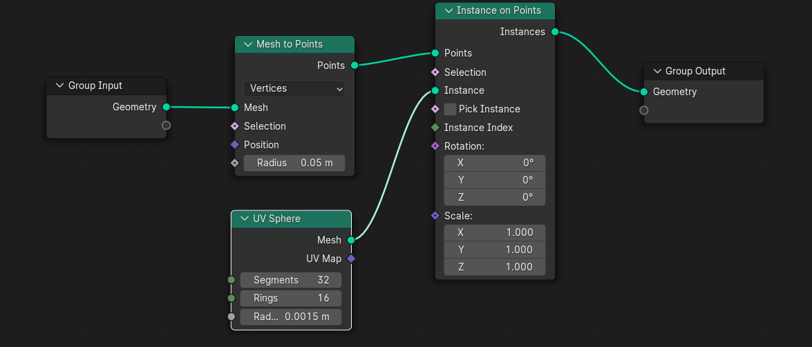

# AstroVisualization
This repo provides examples and resources for creating visualization for astro (scientific) data. 

- Create images/videos with Blender:
  - [Blender environment setup](#blender-environment-setup)
  - [Particle Data (For small data set)](#particle-data-for-small-data-set)
    - Also useful for know how to script in blender
  - [Use Point Cloud to Create Visualization with Large Amount of Particles](#use-point-cloud-to-create-visualization-with-large-amount-of-particles)
  - [Density field data](#density-field-data)
  - [Run Blender Rendering on a cluster](#run-blender-rendering-on-a-cluster)
  - [Other useful things to look up](#other-useful-things-to-look-up)
- Create interactive data experience on website with three.js
   - ... to be added

## Blender environment setup
1. Install Blender 
    * https://www.blender.org/
2. To use other Python library (such as pandas ) in Blender, you need to use the Python executable under the Blender folder.
    * Find the location where you install Blender. (E.g. I used the default path which is "C:\Program Files\Blender Foundation\Blender 3.6\")
    * Find the python.exe under [version_number]/python/bin
    * Right click python.exe file and select "Open in terminal"
    * In the terminal type 
        ```
        .\python.exe -m pip install [package name]
        ```
    * For example, using my path to install pandas in PowerShell would be 
        ```
        PS C:\Program Files\Blender Foundation\Blender 3.6\3.6\python\bin> .\python.exe -m pip install pandas
        ```    
3. If you want to directly use Python libraries that come with Blender (pyopenvdb for example, which can be painful to install in some environments), you can also use the python in your blender folder.
## Particle Data (For small data set)
Particle data is common in astronomical simulations.

Usually, they contains the position information of particles along with related other properties (such as mass, velocity...) as the following:
| Position.x  | Position.y | Position.z | Property 1 | Property 2|
| ------------- | ------------- | ------------- | ------------- |------------- |
| ... | ... | ... |...| ... |

### Create particle visualization with Python scripting in Blender (Get Familiar with Blender Scripting)

This is suitable for people who are used to python programming experience but are overwhelmed by the thousands buttons in 3D softwares. 

#### Start creating particles in Blender
1. Open Blender and create a new "General" file
    
2. Click on the cube in the center of the view and hit delete.
3. On the top banner, select "Scripting" tab.
    
4. Click on "+ New" to create a new script.
5. Import libraries
    ```
    # This is the library for Blender
    import bpy

    # Import other library as needed
    import pandas as pd
    ```
6. The following sciprt shows an example of using a particle file to create small cubes in blender:
    ```
    df = pd.read_csv("file_path")
    for index, row in df.iterrows():
        bpy.ops.mesh.primitive_cube_add(size = 0.1, location=(row['x'],row['y'],row['z']))

    ```
7. Select the "Layout" tab in the top banner and you should see the cubes being created.
    * For example, if my data file is 
        ```
        x,y,z
        1,0,0
        2,0,0
        3,0,0
        0,1,0
        0,2,0
        0,3,0
        ```
    * You will be able to see the following in the view port:
        

### Create an animation of a particle
Sometimes you have a position data of a particle and want to create an animation for it. You can do this by follow [this example script](/BlenderExamples/PositionAnimation.py).

## Use Point Cloud to Create Visualization with Large Amount of Particles
1. Install the open3D python Library for creating point cloud file from particle positions. (This can be done both on your own computer/cluster or in blender)
    ```
    pip install open3D
    ```
2. Use the following script to convert your particle position data into point cloud format. (The shape of the particle position should be (Number of particles, 3) and make sure you normalize your data first.)
    ```
    import open3d as o3d
    pcd = o3d.geometry.PointCloud()
    pcd.points = o3d.utility.Vector3dVector(YourParticlePositions)
    o3d.io.write_point_cloud("Output.ply", pcd)
    ```
3. In Blender, on the top menu, select File -> Import -> Stanford PLY (.ply) to import the Output.ply file

4. You should be able to see the points in the viewport. To make the particle become actual objects in Blender, select the imported object and use Geometry Node as the following:
    
5. Feel free to play around with Radius parameter in the Mesh to Points (which correspondes to the size of each )
6. If you use the [sample point cloud file](/BlenderExamples/sampleParticle.ply) (which is the subhalo positions in the [DREAMS project](https://www.dreams-project.org)), you should see this in Blender viewport:
    


## Density field data

Density field data is another common data format people can use to create good visualization.

Usually, they are represented as arrays in x\*x\*x shape where x is resolution of the field.

### Create density field visualization with Python scripting in Blender
[The example script](/BlenderExamples/DensityFeildVis.py) should be mostly self-explanatory with detailed comments. Basically, we use [OpenVDB](https://www.openvdb.org/) convert our density field data into vdb files which is commonly used in 3D softwares to visualize complex objects like clouds, smoke and file.

#### Start creating density fields in Blender
1. Open Blender and create a new "General" file
2. Navigate to the Scripting workspace from the top menu.
3. Open the script file by selecting File -> Open and navigating to the script's location, or simply paste [the example script](/BlenderExamples/DensityFeildVis.py) into a new text block.
4. Press Run Script to execute.
5. ** If this does not make sense to you, see more detail with images from above.

There is also an [example blender file](/BlenderExamples/DensityFieldExample.blend) you can play around with. If you use the default script and data, you should see the following in Blender:


#### Create animated density fields in Blender
1. If you want to create a animation of your density field, save each frame of data and convert them into vdb files similar to above.
2. Press "Shift + A" and select Volume -> Import OpenVDB... and then select all vdb files for each frame.

   Or

    Include the all the file names into the bpy.ops.object.volume_import() command, for example:
   ```
   bpy.ops.object.volume_import(filepath="PATH\TO\YOUR\FOLDER", directory="PATH\TO\YOUR\FOLDER",
   files=[{"name":"0.vdb", "name":"0.vdb"}, {"name":"1.vdb", "name":"1.vdb"}, {"name":"2.vdb", "name":"2.vdb"},
    {"name":"3.vdb", "name":"3.vdb"}, {"name":"4.vdb", "name":"4.vdb"}, {"name":"5.vdb", "name":"5.vdb"},
   {"name":"6.vdb", "name":"6.vdb"}, {"name":"7.vdb", "name":"7.vdb"}, {"name":"8.vdb", "name":"8.vdb"},
   {"name":"9.vdb", "name":"9.vdb"}], relative_path=True, align='WORLD', location=(0, 0, 0), scale=(1, 1, 1))
   ```

4. When you click play in the animation panel, you should see each frame corresponde to each density field you imported

## Run Blender Rendering on a cluster
Sometimes, rendering images or animations can be heavy or take a long time on your local computer. Fortunately, Blender rendering can be easily run on clusters.
1. Download the Linux version of Blender on your cluster using the links provided on http://blender.org. For example, use the following command to download Blender 4.2
    ```
    wget https://mirror.freedif.org/blender/release/Blender4.2/blender-4.2.0-linux-x64.tar.xz
    ```
2. Unzip the tar.xz file. For example:
    ```
    tar -xf blender-4.2.0-linux-x64.tar.xz
    ```

## Other useful things to look up: 
- Blender scripting documentation
    * https://docs.blender.org/api/current/index.html
- Beginner tutorial for scripting in Blender
    * https://youtu.be/nmJqIaSZlRs?feature=shared
- Point cloud file 
    * Commonly used and supported in 3D world
- Kaze Wong's tutorial for visualizing cosmic web with Blender
    * https://github.com/kazewong/Blender_volume_tutorial
    * https://www.youtube.com/watch?v=fnbhYxj8D_s
